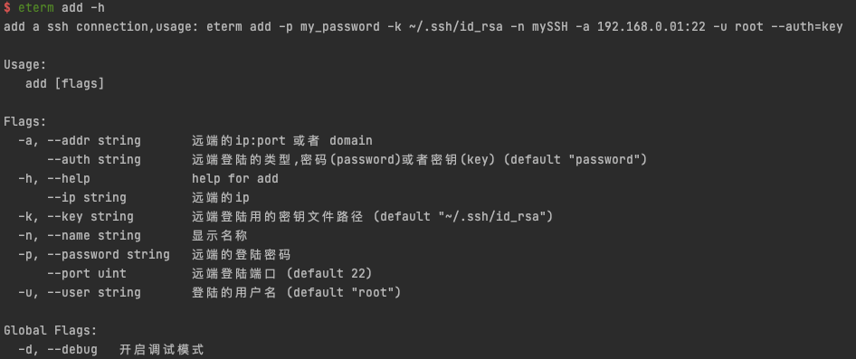
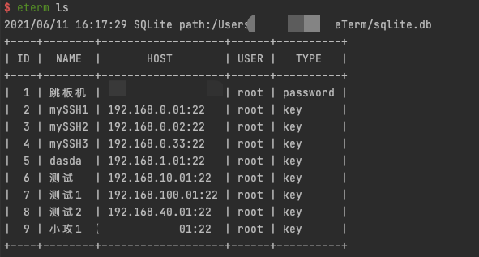
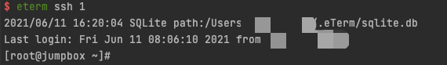

# eTerm

简单易用的ssh管理工具

# Installing
```go
go get https://github.com/knight-zlm/eTerm
go install
// append $GOBIN into your env $PATH
eterm -h
```
or just go build run binary by ./eterm

# ScreenShort
## command: `eterm add` 


## command: `eterm ls`


## command: `eterm ssh 1`


# 功能清单
- [x] 添加连接信息
- [x] 展示连接信息
- [x] 清除所有连接信息
- [x] 通过id号连接远程机器
- [x] 根据id删除记录

# ToDo List
- [ ] 记录的导出和倒入